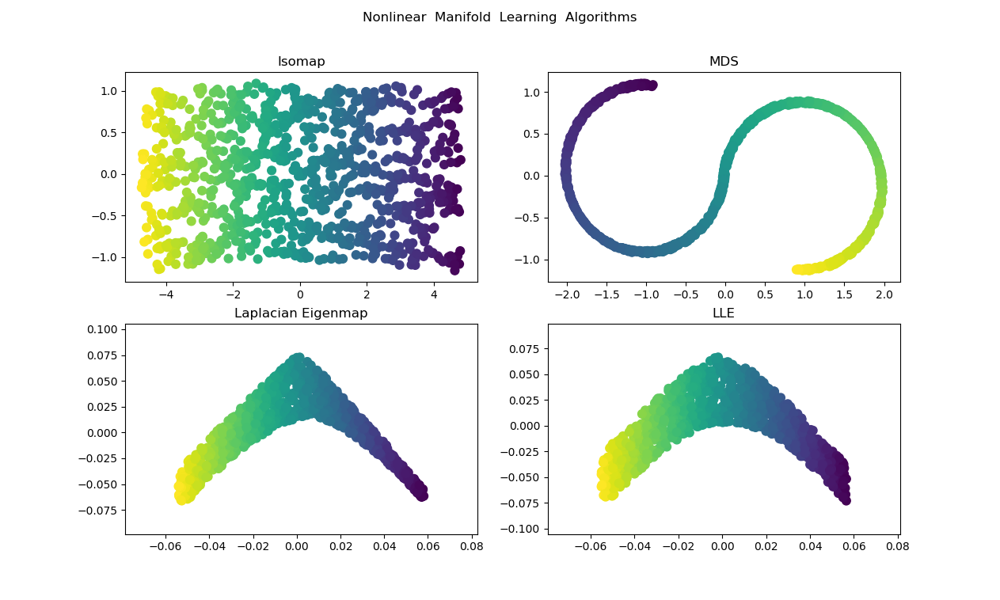
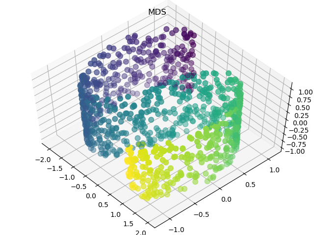
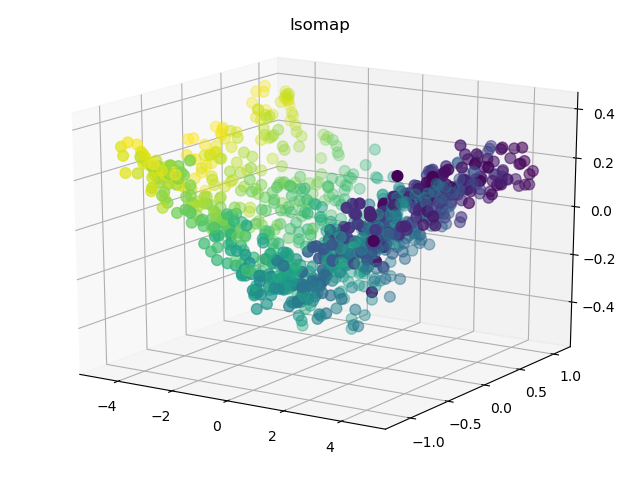
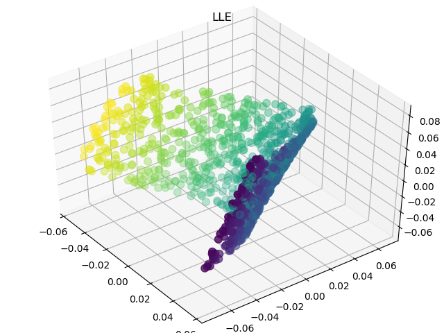

--------------------------------------------------------------------------------
## Requirements
* NumPy 1.16.3
* scikit-learn 0.21.2
* Matplotlib 3.1.0
* Python 3.7

## Usage
### the dataset of Data

```
├── Data
       ├── train
           ├── s1.bmp 
           ├── s2.bmp
           └── ...
       ├── test (The last 10 images of Data)
           ├── s101.bmp 
           ├── s102.bmp
           └── ...
       ├── labels.txt (For attribute information) 
```


## Summary


## Results 
### MDS (Multidimensional Scaling)


### Isomap (Isometric Feature Mapping)


### LLE (Locally Linear Embedding)


### LE (Laplacian Eigenmaps)


## Reference
* [NumPy-Document](https://www.numpy.org/devdocs/reference/index.html)
* [scikit-learn-Document](https://scikit-learn.org/stable/_downloads/scikit-learn-docs.pdf)
* [Matplotlib-Document](https://matplotlib.org/3.1.0/users/index.html)


 

